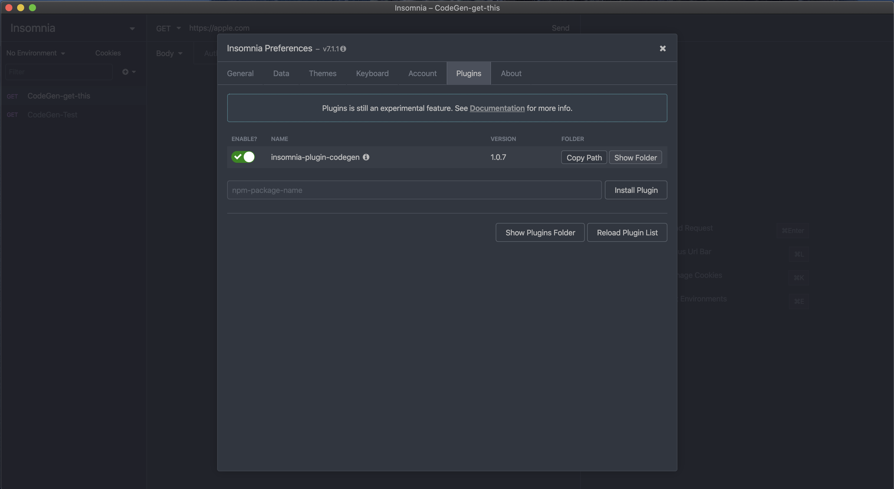
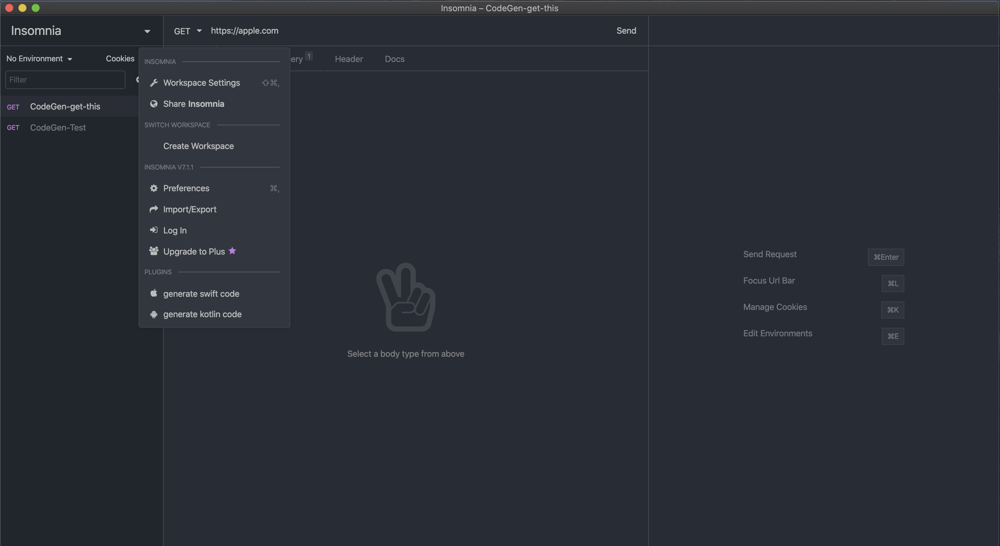

# insomnia-plugin-codegen
Simple insomnia plugin to export swift nsurlsession code for every request using httpsnippet module

## Usage

1. Give a prefix "CodeGen-" for every request you want to export
2. open the pluginsFolder and replace `insomnia-plugin-codegen/custom/custom_swift.js` and `insomnia-plugin-codegen/custom/custom_kotlin.js` with your templates

3. select the 'generate swift code' or 'generate kotlin code'
4. This will export the generated files  here  `~/Desktop` 

