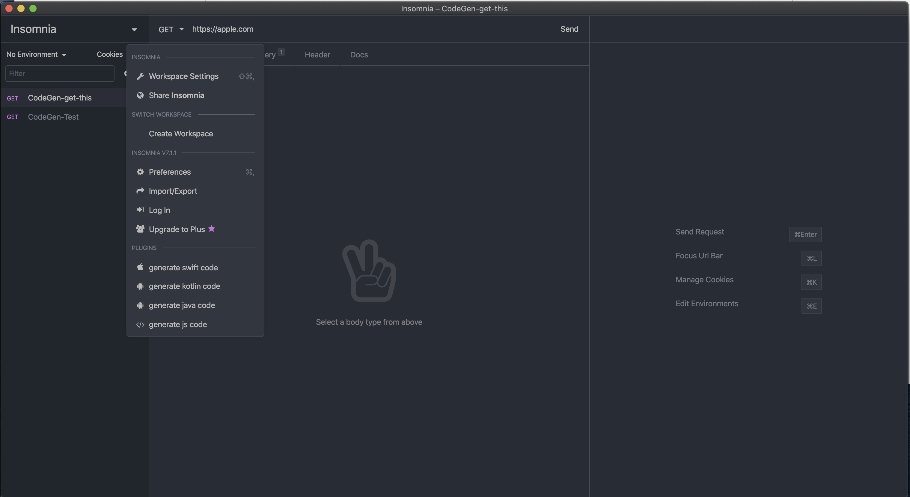

# insomnia-plugin-codegen
Simple insomnia plugin to export code for every request using [httpsnippet](https://github.com/Kong/httpsnippet) module
with custom templates

## Usage

1. Give a prefix "CodeGen-" for every request you want to export
2. open the pluginsFolder and replace code inside templates 
`insomnia-plugin-codegen/custom/custom_swift.js` 
`insomnia-plugin-codegen/custom/custom_kotlin.js`
`insomnia-plugin-codegen/custom/custom_java.js`
`insomnia-plugin-codegen/custom/custom_js.js`

3. Remember to click Reload Plugin List after 

3. Currently supports Swift, Kotlin, Java and JS
4. This will export the generated files  here  `~/Desktop` 

